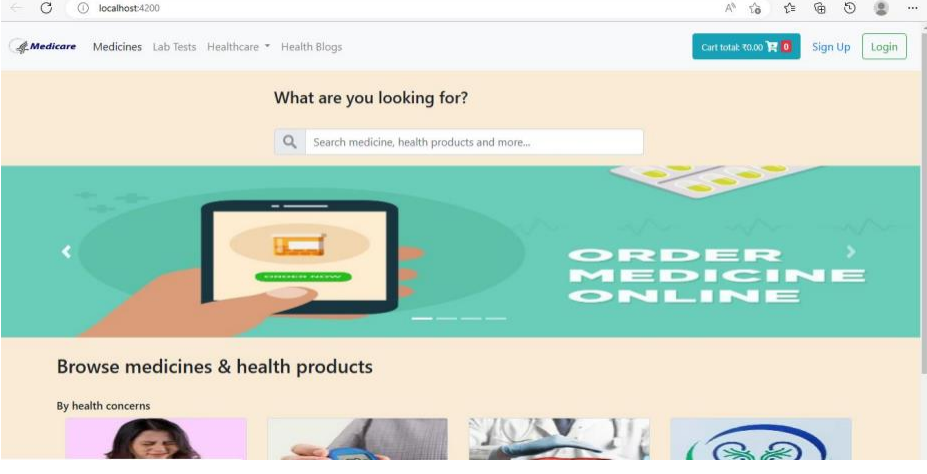
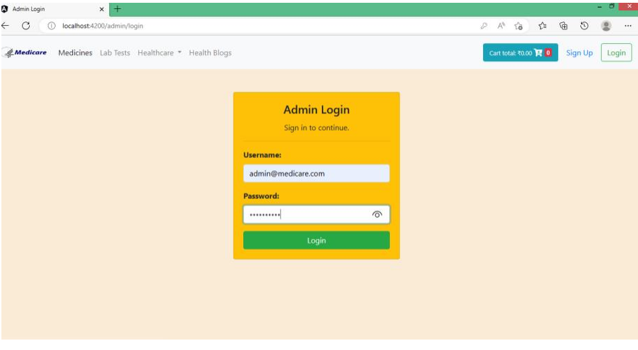

<h2 align="center">Medicare</h2>
  Create a secure medical website using Angular for a dynamic frontend, Spring Boot as the backend framework, and MySQL for the database. Implement JWT authentication for secure login. Utilize TypeScript for scalable frontend development and Spring Data JPA for seamless database integration. Spring Web handles API requests efficiently.

 

### Demo Screeshots

